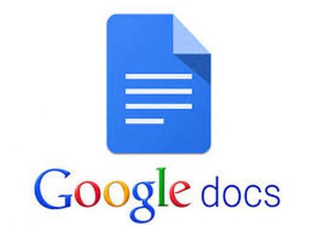

# Example of a web application
Web applications include online forms, shopping carts, word processors, spreadsheets, video and photo editing, file conversion, file scanning, and email programs such as Gmail, Yahoo and AOL. Popular applications include Google Apps and Microsoft 365.

Google Apps for Work has Gmail, Google Docs, Google Sheets, Google Slides, online storage and more. Other functionalities include online sharing of documents and calendars. This lets all team members access the same version of a document simultaneously.

## The top 5 examples of web app 
1.Google Docs
Google’s office suite is one of the best web applications in the world. Google Docs allows us to create documents, save them on our computer or on our Google Drive account, save them in PDF format, print them, and share them with our colleagues. And most importantly: it enables us to work on the same document with our colleagues.

2.Pixlr.com
Pixlr is one of the best web applications for photo editing. This app is inspired by the well-known photo editing programme Adobe Photoshop, as the programme’s design and its structure let us know right away. This application will, therefore, be very familiar among those of us who are Adobe Photoshop users.

3.Codepen.io
This is the perfect tool for those starting out in the web app development industry. It’s basically a small HTML code development environment in our browser. Which means it’s a really useful tool to test our HTML, CSS and JavaScript codes in real-time.

4.Evernote and Trello
It’s quite common to come across someone who still uses classic post-its and sticks them on his fridge at home or on his desktop at the office. Well, now post-its have been updated and are on the Internet — like is happening to most things around us.

5.Netflix
Netflix allows its users to watch their favourite series and movies whenever they want, with no limitation as to time or schedules in which to enjoy these services. On top of that, it doesn’t matter where the user is when he wants to see some of Netflix’s contents since it’s a cross-platform service, compatible with all operating systems.
