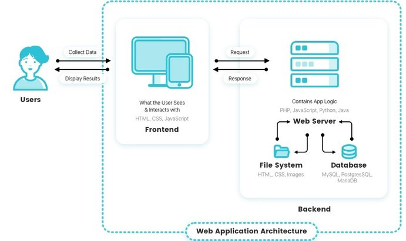

# How a web application works
Web applications are usually coded in browser-supported language such as JavaScript and HTML as these languages rely on the browser to render the program executable. Some of the applications are dynamic, requiring server-side processing. Others are completely static with no processing required at the server.

The web application requires a web server to manage requests from the client, an application server to perform the tasks requested, and, sometimes, a database to store the information. Application server technology ranges from ASP.NET, ASP and ColdFusion, to PHP and JSP.

Here's what a typical web application flow looks like:

### 1. User triggers a request to the web server over the Internet, either through a web browser or the application’s user interface

### 2. Web server forwards this request to the appropriate web application server

### 3. Web application server performs the requested task – such as querying the database or processing the data – then generates the results of the requested data

### 4. Web application server sends results to the web server with the requested information or processed data

### 5. Web server responds back to the client with the requested information that then appears on the user’s display
